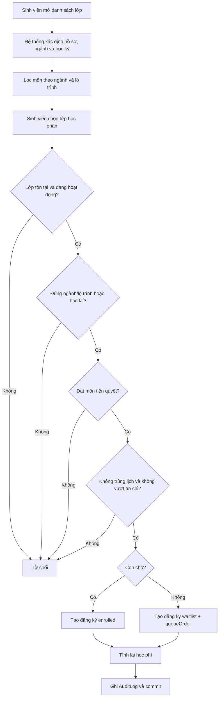
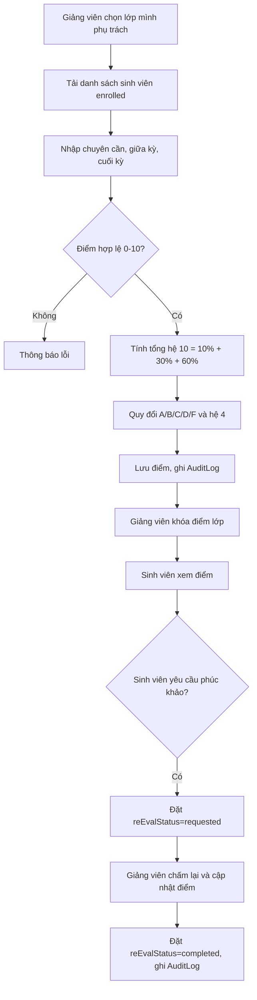
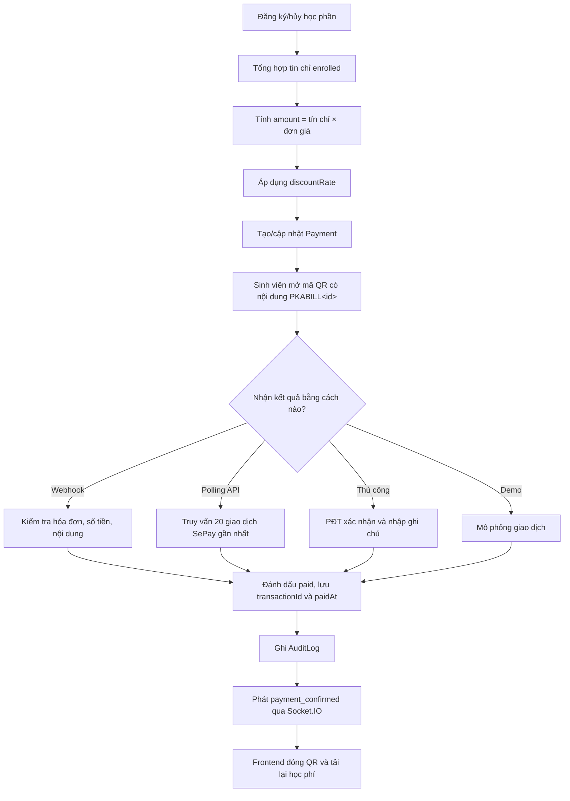
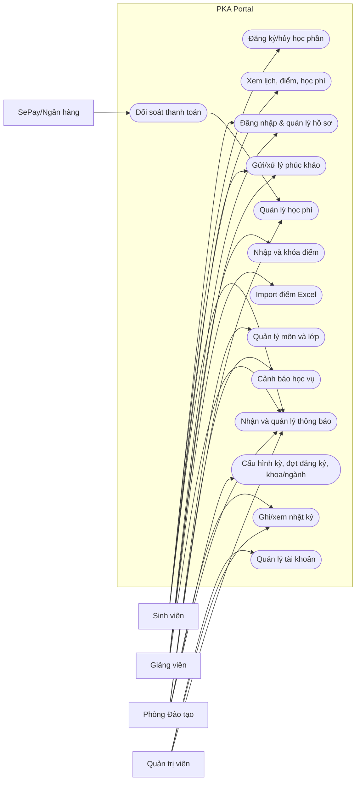
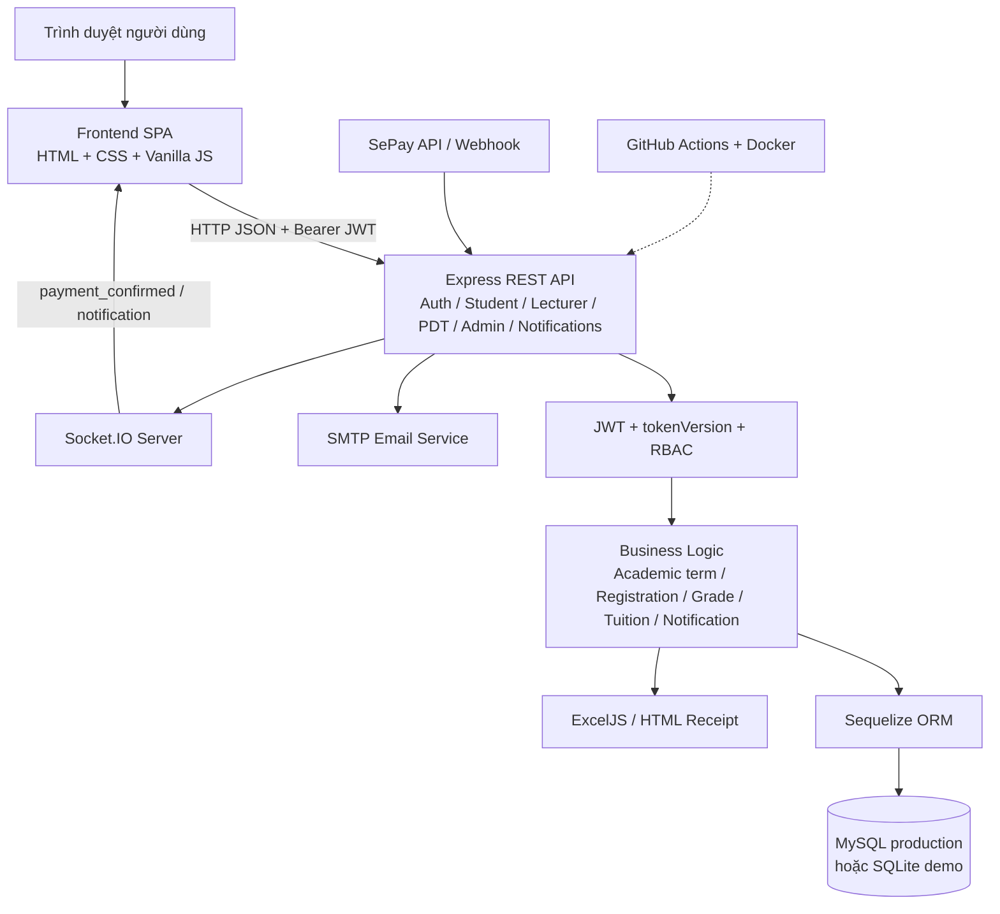
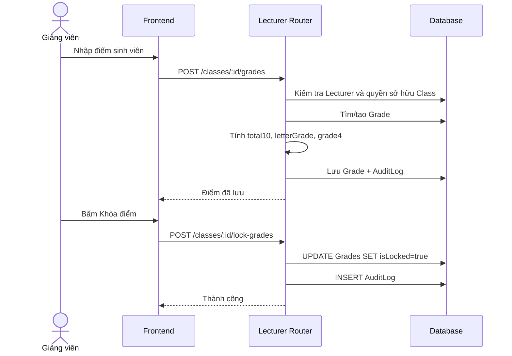
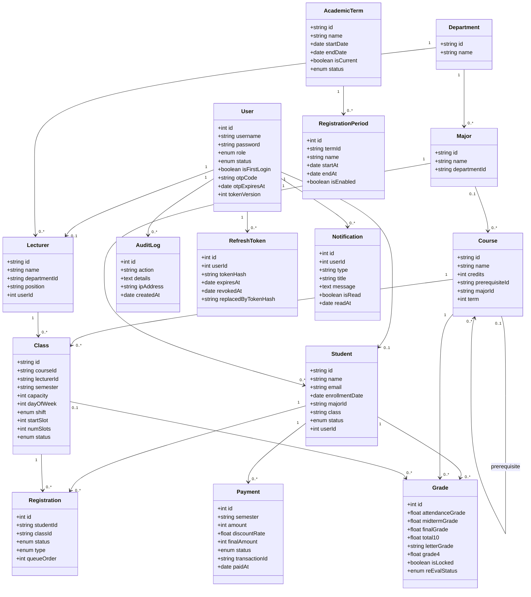
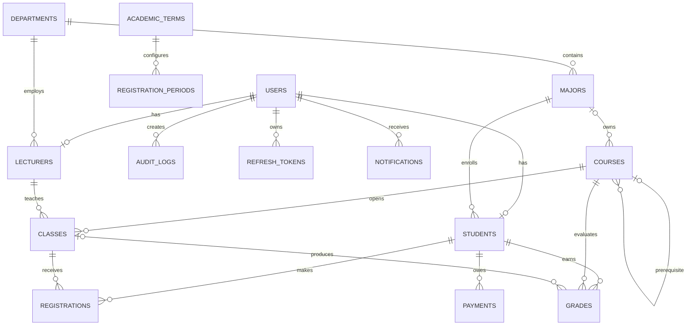

# ĐẠI HỌC PHENIKAA

**TRƯỜNG CÔNG NGHỆ THÔNG TIN PHENIKAA**

**HỌC PHẦN: PHÂN TÍCH VÀ THIẾT KẾ PHẦN MỀM**

**ĐỀ TÀI: HỆ THỐNG CỔNG THÔNG TIN ĐÀO TẠO VÀ ĐĂNG KÝ HỌC PHẦN (PKA PORTAL)**

Giảng viên hướng dẫn: *[Bổ sung]*

Nhóm: *[Bổ sung tên nhóm và danh sách thành viên]*

Lớp tín chỉ: *[Bổ sung]*

**Hà Nội, tháng 7 năm 2026**

---

## MỤC LỤC

- [1. YÊU CẦU (REQUIREMENTS)](#1-yêu-cầu-requirements)
  - [1.1 Đặt vấn đề](#11-đặt-vấn-đề-problem-statement)
  - [1.2 Thuật ngữ](#12-thuật-ngữ-glossary)
  - [1.3 Thông số kỹ thuật bổ sung](#13-thông-số-kỹ-thuật-bổ-sung)
  - [1.4 Mô hình hóa quy trình nghiệp vụ](#14-mô-hình-hóa-quy-trình-nghiệp-vụ)
  - [1.5 Mô hình hóa chức năng](#15-mô-hình-hóa-chức-năng)
  - [1.6 Đặc tả các Use-case](#16-đặc-tả-các-use-case)
- [2. PHÂN TÍCH TRƯỜNG HỢP SỬ DỤNG](#2-phân-tích-trường-hợp-sử-dụng-use-case-analysis)
  - [2.1 Phân tích kiến trúc hệ thống](#21-phân-tích-kiến-trúc-hệ-thống)
  - [2.2 Thực thi trường hợp sử dụng](#22-thực-thi-trường-hợp-sử-dụng-use-case-realizations)
- [3. THIẾT KẾ](#3-thiết-kế-use-case-design)
  - [3.1 Xác định các thành phần thiết kế](#31-xác-định-các-thành-phần-thiết-kế-identify-design-elements)
  - [3.2 Thiết kế trường hợp sử dụng](#32-thiết-kế-trường-hợp-sử-dụng-use-case-design)
  - [3.3 Thiết kế cơ sở dữ liệu](#33-thiết-kế-cơ-sở-dữ-liệu-database-design)
- [4. CÀI ĐẶT](#4-cài-đặt-implementation)
- [5. KẾT LUẬN](#5-kết-luận)
- [TÀI LIỆU THAM KHẢO](#tài-liệu-tham-khảo)
- [PHỤ LỤC](#phụ-lục)

---

# 1. YÊU CẦU (REQUIREMENTS)

## 1.1 Đặt vấn đề (Problem statement)

### 1.1.1 Bối cảnh

Trong hoạt động đào tạo đại học, dữ liệu sinh viên, môn học, lớp học phần, lịch học, kết quả học tập và học phí có quan hệ chặt chẽ với nhau. Nếu các nghiệp vụ này được xử lý bằng nhiều tệp rời hoặc nhiều hệ thống không liên thông, sinh viên khó theo dõi tiến độ học tập; giảng viên mất thời gian tổng hợp điểm; Phòng Đào tạo khó kiểm soát xung đột lịch, sĩ số và cảnh báo học vụ; quản trị viên khó quản lý tài khoản và truy vết thay đổi.

PKA Portal được xây dựng như một cổng thông tin đào tạo tập trung. Hệ thống cung cấp giao diện web một trang cho bốn vai trò: sinh viên, giảng viên, Phòng Đào tạo và quản trị viên. Dữ liệu được quản lý trong cơ sở dữ liệu quan hệ thông qua Sequelize ORM; các chức năng nghiệp vụ được cung cấp qua REST API; kết quả thanh toán có thể được cập nhật theo thời gian thực bằng Socket.IO và SePay.

Phân tích trong báo cáo dựa trên mã nguồn và cơ sở dữ liệu tại `D:\Code web pt` sau lần cập nhật và kiểm thử ngày 26/07/2026. Báo cáo phân biệt rõ chức năng đã cài đặt, cấu hình môi trường cần cung cấp khi triển khai và các hạng mục vẫn còn là định hướng.

### 1.1.2 Mục tiêu

Hệ thống hướng tới các mục tiêu sau:

1. Tập trung hóa dữ liệu tài khoản, hồ sơ đào tạo, đăng ký học phần, điểm và học phí.
2. Cho phép sinh viên đăng ký/hủy học phần trực tuyến và tự động kiểm tra điều kiện nghiệp vụ.
3. Hỗ trợ giảng viên quản lý lớp, nhập điểm, khóa điểm và xử lý phúc khảo.
4. Hỗ trợ Phòng Đào tạo quản lý môn học, lớp học phần, học phí và cảnh báo học vụ.
5. Hỗ trợ quản trị viên quản lý vòng đời tài khoản và hồ sơ người dùng.
6. Tự động tính học phí theo số tín chỉ đăng ký và cập nhật khi đăng ký thay đổi.
7. Ghi nhật ký các thao tác quan trọng để phục vụ kiểm tra và truy vết.
8. Cung cấp báo cáo/bảng điểm dưới dạng Excel và biên lai học phí dạng HTML có thể in.
9. Hỗ trợ xác nhận thanh toán tự động qua SePay và thông báo tức thời cho sinh viên.

### 1.1.3 Người dùng mục tiêu

| Tác nhân | Vai trò trong hệ thống | Nhu cầu chính |
|---|---|---|
| Sinh viên | `student` | Xem tiến độ học tập, đăng ký/hủy học phần, xem lịch, học phí, điểm và gửi phúc khảo |
| Giảng viên | `lecturer` | Xem lịch dạy, danh sách lớp, nhập/khóa điểm, xử lý phúc khảo và xuất bảng điểm |
| Phòng Đào tạo | `pdt` | Quản lý môn/lớp, kiểm tra lịch, hủy lớp thiếu sĩ số, quản lý học phí và cảnh báo học vụ |
| Quản trị viên | `admin` | Tạo, sửa, khóa, đặt lại mật khẩu, xóa tài khoản/hồ sơ và xem nhật ký |
| SePay/ngân hàng | Hệ thống ngoài | Gửi hoặc cung cấp dữ liệu giao dịch để đối soát học phí |

### 1.1.4 Lợi ích khi sử dụng phần mềm

- Sinh viên nhận phản hồi ngay khi đăng ký sai điều kiện tiên quyết, vượt số tín chỉ hoặc trùng lịch.
- Danh sách chờ FIFO giúp sử dụng tối đa chỗ trống của lớp học phần.
- Học phí được tính lại đồng bộ với số tín chỉ đã đăng ký chính thức.
- Giảng viên chỉ cần nhập ba thành phần điểm; hệ thống tự tính điểm hệ 10, chữ và hệ 4.
- Phòng Đào tạo phát hiện xung đột phòng học/giảng viên khi xếp lịch.
- Cảnh báo học vụ được tính từ GPA học kỳ và CPA tích lũy.
- Nhật ký hệ thống hỗ trợ kiểm tra các thao tác nhạy cảm.
- Dữ liệu được dùng chung giữa các phân hệ, giảm nhập liệu trùng lặp.
- Thông báo thanh toán thời gian thực giảm nhu cầu làm mới trang hoặc đối soát thủ công.

### 1.1.5 Phạm vi của dự án

**Trong phạm vi hiện đã cài đặt**

- Xác thực bằng JWT, kiểm tra trạng thái khóa và phân quyền theo bốn vai trò.
- Mật khẩu bcrypt, access token ngắn hạn, refresh token xoay vòng, đăng xuất và thu hồi phiên phía máy chủ.
- Quên mật khẩu bằng OTP được băm và gửi qua SMTP; `mock_otp` chỉ được phép khi bật rõ trong môi trường phát triển.
- Quản lý hồ sơ sinh viên, giảng viên và tài khoản cán bộ.
- Cấu hình học kỳ hiện hành và thời gian mở/đóng đăng ký trên giao diện Phòng Đào tạo.
- CRUD khoa và ngành trên API/giao diện Phòng Đào tạo.
- Quản lý môn học, môn tiên quyết, lớp học phần và lịch học.
- Đăng ký, hủy đăng ký, hàng chờ, học lại và học cải thiện.
- Kiểm tra ngành học, lộ trình học kỳ, môn tiên quyết, trùng lịch và giới hạn tín chỉ.
- Quản lý điểm, nhập điểm hàng loạt từ Excel, khóa điểm, GPA/CPA và phúc khảo.
- Tính và quản lý học phí, miễn giảm, xác nhận thủ công, SePay và Socket.IO.
- Thông báo tổng quát có lưu CSDL, trạng thái đã đọc/chưa đọc và đẩy thời gian thực qua Socket.IO.
- Cảnh báo học vụ, nhật ký hệ thống và phân trang các danh sách lớn.
- Xuất Excel bảng điểm/danh sách/cảnh báo/học phí và xuất biên lai HTML.
- Kiểm thử tự động, GitHub Actions CI, Dockerfile, health check và cấu hình production bằng biến môi trường.

**Ngoài phạm vi hoặc còn cần hoàn thiện**

- Chưa có bộ migration schema có phiên bản; ứng dụng vẫn dùng `sequelize.sync()` và một số `ALTER TABLE` tương thích ngược.
- Chưa có rate limiting cho đăng nhập/OTP và chưa có validation schema tập trung bằng Joi/Zod.
- Bộ kiểm thử tự động hiện mới bao phủ helper; chưa có đầy đủ integration test và E2E cho bốn vai trò.
- Đã có CI và cấu hình đóng gói Docker nhưng chưa triển khai lên hạ tầng production thực tế vì chưa có máy chủ, tên miền, chứng thư TLS và thông tin MySQL/SMTP production.
- Chưa có monitoring tập trung, structured logging, backup tự động và quy trình disaster recovery.
- Một số truy vấn danh sách còn dạng N+1 và frontend vẫn còn vị trí render bằng `innerHTML`; cần tiếp tục tối ưu hiệu năng và rà soát XSS.
- `npm audit` còn cảnh báo ở phụ thuộc gián tiếp của ExcelJS/Sequelize; phương án `--force` do npm đề xuất có thay đổi phiên bản lớn nên chưa áp dụng.

## 1.2 Thuật ngữ (Glossary)

| Thuật ngữ | Giải thích |
|---|---|
| Học phần/Course | Môn học trong chương trình đào tạo, có mã, tên, số tín chỉ và có thể có môn tiên quyết |
| Lớp học phần/Class | Một lần mở cụ thể của học phần theo học kỳ, giảng viên, phòng và lịch |
| Đăng ký học phần/Registration | Quan hệ giữa sinh viên và lớp học phần |
| Tín chỉ | Đơn vị khối lượng học tập, dùng để kiểm soát tải học và tính học phí |
| Môn tiên quyết | Môn phải hoàn thành trước khi được đăng ký môn tiếp theo |
| Hàng chờ/Waitlist | Danh sách sinh viên chờ khi lớp đã đủ sĩ số, sắp theo FIFO |
| Học lại/Retake | Đăng ký lại môn đã bị điểm F và chưa có lần đạt |
| Học cải thiện/Improve | Học lại môn đã đạt để cải thiện kết quả |
| GPA | Điểm trung bình có trọng số tín chỉ trong một học kỳ |
| CPA | Điểm trung bình tích lũy; với môn học nhiều lần, hệ thống chọn kết quả hệ 4 cao nhất |
| Khóa điểm | Chốt điểm của lớp; sau khi khóa, giảng viên không sửa bằng luồng nhập điểm thường |
| Phúc khảo | Yêu cầu xem xét và chấm lại kết quả của sinh viên |
| Học phí | Khoản phải nộp, tính theo tổng tín chỉ đăng ký chính thức nhân đơn giá |
| Miễn giảm | Tỷ lệ giảm học phí từ 0 đến 100%, có lý do đi kèm |
| JWT | Chuỗi xác thực có chữ ký, chứa mã người dùng, tên đăng nhập và vai trò |
| Access token | JWT sống ngắn dùng để gọi API; mặc định hết hạn sau 15 phút |
| Refresh token | Chuỗi ngẫu nhiên được băm trong CSDL, dùng để cấp lại access token và được xoay vòng sau mỗi lần sử dụng |
| Học kỳ hiện hành | Bản ghi `AcademicTerm` được đánh dấu `isCurrent`, làm nguồn cấu hình chung cho các phân hệ |
| Đợt đăng ký | Khoảng thời gian mở/đóng cổng đăng ký gắn với một học kỳ |
| Notification | Thông báo lưu bền vững theo người dùng, có trạng thái đã đọc/chưa đọc |
| RBAC | Kiểm soát truy cập dựa trên vai trò |
| REST API | Giao diện HTTP để frontend trao đổi dữ liệu với backend |
| ORM | Lớp ánh xạ giữa đối tượng JavaScript và bảng cơ sở dữ liệu |
| Transaction | Nhóm thao tác dữ liệu được commit toàn bộ hoặc rollback toàn bộ |
| Webhook | Endpoint nhận thông báo giao dịch từ hệ thống thanh toán bên ngoài |
| Socket.IO | Kênh giao tiếp hai chiều để đẩy thông báo thời gian thực |
| Audit Log | Nhật ký bất biến về người thực hiện, hành động, chi tiết, IP và thời gian |

## 1.3 Thông số kỹ thuật bổ sung

### 1.3.1 Yêu cầu phi chức năng

| Mã | Nhóm | Yêu cầu |
|---|---|---|
| NFR-01 | Bảo mật | API nghiệp vụ phải yêu cầu JWT hợp lệ và kiểm tra đúng vai trò |
| NFR-02 | Bảo mật | Mật khẩu phải được băm bằng thuật toán thích hợp; không lưu dạng rõ |
| NFR-03 | Bảo mật | OTP phải có thời hạn, chỉ dùng một lần và không được trả về ở production |
| NFR-04 | Toàn vẹn | Đăng ký/hủy môn và tạo/xóa tài khoản phải chạy trong transaction |
| NFR-05 | Đồng thời | Khi nhiều sinh viên đăng ký, sĩ số không được vượt quá `capacity` |
| NFR-06 | Tin cậy | Dữ liệu thanh toán phải đối soát số tiền, nội dung và thời điểm giao dịch |
| NFR-07 | Truy vết | Thao tác nhạy cảm phải ghi AuditLog với người dùng và thời điểm |
| NFR-08 | Hiệu năng | Phản hồi thao tác thông thường mục tiêu dưới 2 giây trong mạng nội bộ |
| NFR-09 | Khả dụng | Giao diện phải dùng được trên desktop, tablet và mobile |
| NFR-10 | Tương thích | Backend hỗ trợ MySQL; SQLite dùng cho demo/phát triển |
| NFR-11 | Bảo trì | Logic nghiệp vụ dùng chung phải tách vào helper/service thay vì lặp trong route |
| NFR-12 | Dữ liệu | Các cặp đăng ký và hóa đơn nghiệp vụ phải được ràng buộc duy nhất |
| NFR-13 | Sao lưu | CSDL production cần sao lưu định kỳ và có quy trình khôi phục |
| NFR-14 | Quan sát | Lỗi server phải được ghi log có ngữ cảnh nhưng không làm lộ bí mật |

### 1.3.2 Ràng buộc thiết kế và hiện trạng

- Backend dùng Node.js ESM, Express 4, Sequelize 6.
- Frontend là HTML5, CSS3 và Vanilla JavaScript; không dùng framework.
- Backend phục vụ trực tiếp thư mục `frontend`, tạo một gói triển khai đơn giản.
- CSDL tự đồng bộ bằng `sequelize.sync()`; production dừng khởi động nếu đồng bộ hoặc kết nối MySQL thất bại.
- Trong development, hệ thống thử MySQL trước và có thể chuyển sang SQLite; production không âm thầm fallback nếu MySQL lỗi.
- Access token mặc định có thời hạn 15 phút; refresh token mặc định có thời hạn 7 ngày và được lưu dưới dạng hash.
- Học kỳ hiện hành được đọc từ bảng `AcademicTerms`; `CURRENT_SEMESTER`/`HK1-2025` chỉ là giá trị dự phòng và dữ liệu seed ban đầu.
- Đơn giá trong code hiện tại là `1.000` đơn vị tiền/tín chỉ (`COST_PER_CREDIT = 1000`). Con số này phù hợp dữ liệu demo, không phải mức học phí thực tế.
- Hạn đóng mặc định được đặt sau ngày tạo hóa đơn hai tháng.
- Sinh viên bình thường tối đa 24 tín chỉ/kỳ; sinh viên bị cảnh báo mức 1 hoặc mức 2 tối đa 12 tín chỉ/kỳ; sinh viên bị buộc thôi học không được đăng ký học phần.
- Lớp có dưới 15 sinh viên mới được Phòng Đào tạo hủy theo luồng hiện tại.
- Điểm tổng kết: chuyên cần 10%, giữa kỳ 30%, cuối kỳ 60%.
- Điều kiện cảnh báo: GPA kỳ hiện tại dưới 1,0 hoặc CPA dưới 1,5. Lần cảnh báo đầu áp dụng mức 1; nếu kết quả chưa cải thiện ở lần xét tiếp theo thì chuyển mức 2. Trạng thái được duyệt tuần tự `active` → `warning_1` → `warning_2` → `dismissed`.

### 1.3.3 Đánh giá bảo mật hiện trạng

Code hiện đã có JWT/RBAC, bcrypt, token version, refresh-token rotation/revocation, Socket.IO authentication, owner check cho API thanh toán, secret webhook và CORS theo danh sách origin production. Mật khẩu cũ trong SQLite đã được chuyển sang bcrypt; OTP được băm, hết hạn sau năm phút và gửi qua SMTP. Production bắt buộc có `JWT_SECRET`, không trả `mock_otp` và không chấp nhận webhook thiếu secret.

Các rủi ro còn lại cần quản lý:

1. Access token và refresh token đang lưu trong `localStorage`, do đó XSS có thể làm lộ phiên.
2. Chưa có rate limit và khóa tạm thời cho đăng nhập, refresh token hoặc yêu cầu OTP.
3. Một số dữ liệu được render bằng `innerHTML`; helper `escapeHtml` đã được dùng ở các phần mới nhưng chưa bao phủ tuyệt đối toàn bộ giao diện cũ.
4. Webhook dùng shared secret; khi nhà cung cấp hỗ trợ chữ ký HMAC theo payload nên chuyển sang xác minh chữ ký và thêm cơ chế idempotency chính thức.
5. Chưa có CSP, security headers chuyên dụng và kho bí mật tập trung cho môi trường production.

## 1.4 Mô hình hóa quy trình nghiệp vụ

### 1.4.1 Quy trình đăng ký và hủy học phần



Khi sinh viên hủy một đăng ký `enrolled`, hệ thống xóa bản ghi, đưa người đầu tiên trong hàng chờ lên `enrolled`, đánh lại thứ tự hàng chờ, tính lại học phí và ghi nhật ký. Các thao tác được đặt trong transaction.

### 1.4.2 Quy trình nhập điểm, khóa điểm và phúc khảo



### 1.4.3 Quy trình thanh toán học phí



### 1.4.4 Quy trình hủy lớp thiếu sĩ số

1. Phòng Đào tạo chọn lớp học phần.
2. Hệ thống kiểm tra lớp tồn tại, chưa bị hủy và đếm số sinh viên `enrolled`.
3. Nếu sĩ số từ 15 trở lên, hệ thống từ chối.
4. Nếu sĩ số dưới 15, hệ thống chuyển lớp sang `canceled`.
5. Hệ thống lấy toàn bộ đăng ký bị ảnh hưởng và xóa các đăng ký.
6. Học phí của từng sinh viên được tính lại.
7. Hệ thống ghi `HUY_LOP_THIEU_SI_SO` và commit transaction.

## 1.5 Mô hình hóa chức năng

### 1.5.1 Các yêu cầu chức năng

#### R1. Xác thực và hồ sơ

- R1.1 Đăng nhập bằng username, email hoặc mã sinh viên/giảng viên.
- R1.2 Từ chối tài khoản có trạng thái `locked`.
- R1.3 Cấp access token JWT chứa `id`, `username`, `role`, `tokenVersion`, mặc định có thời hạn 15 phút.
- R1.4 Cấp refresh token ngẫu nhiên, lưu hash phía máy chủ, xoay vòng khi làm mới và tự động khôi phục phiên ở frontend.
- R1.5 Đổi mật khẩu khi cung cấp đúng mật khẩu hiện tại.
- R1.6 Tạo OTP sáu chữ số có hiệu lực năm phút.
- R1.7 Đặt lại mật khẩu bằng OTP hợp lệ.
- R1.8 Sinh viên được cập nhật email cá nhân.
- R1.9 Đăng xuất phía máy chủ, thu hồi refresh token và vô hiệu hóa access token cũ bằng `tokenVersion`.
- R1.10 Cung cấp ngữ cảnh học kỳ/đợt đăng ký hiện hành cho frontend.

#### R2. Chức năng sinh viên

- R2.1 Xem lớp học phần đang mở phù hợp với ngành và học kỳ lộ trình.
- R2.2 Xem sĩ số, hàng chờ, môn tiên quyết và trạng thái đăng ký cá nhân.
- R2.3 Đăng ký học phần.
- R2.4 Hủy đăng ký học phần.
- R2.5 Tự động chuyển người đầu hàng chờ vào lớp khi có chỗ.
- R2.6 Xem danh sách môn đã đăng ký và thời khóa biểu.
- R2.7 Xem hóa đơn, miễn giảm, hạn nộp và trạng thái thanh toán.
- R2.8 Thanh toán/đối soát qua QR.
- R2.9 Xem điểm, GPA, CPA, tín chỉ tích lũy và tiến độ.
- R2.10 Gửi yêu cầu phúc khảo.
- R2.11 Xuất bảng điểm Excel và biên lai học phí.
- R2.12 Xem trạng thái mở/đóng cổng và chỉ đăng ký/hủy trong thời gian được cấu hình.
- R2.13 Nhận và quản lý thông báo cá nhân theo thời gian thực.

#### R3. Chức năng giảng viên

- R3.1 Xem hồ sơ và thời khóa biểu giảng dạy.
- R3.2 Xem các lớp phụ trách và danh sách sinh viên.
- R3.3 Nhập/sửa điểm khi điểm chưa khóa.
- R3.4 Tự động tính điểm tổng kết và quy đổi thang điểm.
- R3.5 Khóa điểm của toàn lớp.
- R3.6 Xem và giải quyết yêu cầu phúc khảo.
- R3.7 Xuất bảng điểm lớp ra Excel.
- R3.8 Import điểm hàng loạt từ `.xlsx`, kiểm tra quyền lớp, thành viên, miền điểm 0–10 và rollback toàn bộ khi có dòng lỗi.
- R3.9 Phát thông báo khi khóa/công bố điểm hoặc giải quyết phúc khảo.

#### R4. Chức năng Phòng Đào tạo

- R4.1 Xem thống kê số sinh viên, giảng viên, môn và lớp.
- R4.2 Xem/tạo môn học và khai báo môn tiên quyết.
- R4.3 Xem/tạo lớp học phần.
- R4.4 Kiểm tra trùng phòng và trùng lịch giảng viên.
- R4.5 Hủy lớp thiếu sĩ số và tính lại học phí.
- R4.6 Tính danh sách sinh viên thuộc diện cảnh báo.
- R4.7 Cập nhật mức cảnh báo của sinh viên.
- R4.8 Xem và xuất báo cáo học phí.
- R4.9 Thiết lập miễn giảm và lý do.
- R4.10 Xác nhận thanh toán thủ công.
- R4.11 Xem AuditLog.
- R4.12 CRUD khoa và ngành, có kiểm tra quan hệ phụ thuộc khi xóa.
- R4.13 CRUD học kỳ và đợt đăng ký; chọn duy nhất một học kỳ hiện hành.
- R4.14 Cấu hình bật/tắt và thời gian mở/đóng cổng đăng ký trên giao diện.
- R4.15 Phân trang môn học, lớp học phần, học phí, cảnh báo học vụ và nhật ký.

#### R5. Chức năng quản trị

- R5.1 Xem/lọc tài khoản theo vai trò.
- R5.2 Tạo tài khoản kèm hồ sơ sinh viên/giảng viên trong một transaction.
- R5.3 Tạo tài khoản cán bộ Phòng Đào tạo hoặc quản trị.
- R5.4 Khóa/mở khóa và đặt lại mật khẩu.
- R5.5 Sửa hồ sơ sinh viên/giảng viên.
- R5.6 Xóa tài khoản và hồ sơ liên quan.
- R5.7 Xem AuditLog.

#### R6. Quy tắc nghiệp vụ

- R6.1 Chỉ đăng ký môn thuộc chương trình của ngành hoặc nhóm môn dùng chung.
- R6.2 Chỉ đăng ký môn đúng học kỳ lộ trình, trừ học lại môn F.
- R6.3 Phải đạt môn tiên quyết bằng điểm khác F đã khóa.
- R6.4 Không được đăng ký hai lớp có khoảng tiết giao nhau cùng ngày và ca.
- R6.5 Giới hạn 24 tín chỉ; sinh viên cảnh báo giới hạn 12.
- R6.6 Khi lớp đầy, đăng ký chuyển sang hàng chờ FIFO.
- R6.7 Chỉ đăng ký `enrolled` được tính học phí.
- R6.8 Lớp chỉ được hủy theo luồng thiếu sĩ số khi có dưới 15 sinh viên.
- R6.9 Điểm chỉ hiển thị cho sinh viên khi `isLocked = true`.
- R6.10 Đăng ký và hủy đăng ký chỉ được thực hiện khi đợt đăng ký của học kỳ hiện hành đang bật và thời gian máy chủ nằm trong khoảng mở–đóng.
- R6.11 Mỗi lần dùng refresh token sẽ thu hồi token cũ và cấp cặp token mới.
- R6.12 Không sửa điểm đã khóa bằng API nhập điểm thường.

### 1.5.2 Sơ đồ Use-case



## 1.6 Đặc tả các Use-case

### 1.6.1 UC1. Đăng nhập hệ thống

| Thuộc tính | Nội dung |
|---|---|
| Số và tên UC | UC1 – Đăng nhập hệ thống |
| Người tạo UC | Nhóm dự án PKA Portal |
| Ngày cập nhật | 26/07/2026 |
| Mô tả | Xác thực người dùng và mở giao diện theo vai trò |
| Tác nhân chính | Sinh viên, giảng viên, PĐT, quản trị viên |
| Sự kiện kích hoạt | Người dùng gửi form đăng nhập |
| Tiền điều kiện | Tài khoản tồn tại và chưa bị khóa |
| Hậu điều kiện | Access token và refresh token được cấp; hồ sơ, học kỳ hiện hành và menu đúng vai trò được hiển thị |
| Luồng thông thường | 1. Nhập định danh và mật khẩu. 2. Backend tìm User. 3. Kiểm tra trạng thái và bcrypt. 4. Tải hồ sơ. 5. Cấp access token 15 phút và refresh token 7 ngày. 6. Frontend lưu phiên, tải ngữ cảnh học kỳ và mở dashboard. |
| Luồng thay thế | Người dùng có thể nhập username đầy đủ, phần trước `@pka.edu.vn`, MSV/MGV hoặc email sinh viên |
| Ngoại lệ | Sai thông tin: 401; tài khoản khóa: 403; lỗi server: 500 |
| Độ ưu tiên | Rất cao |
| Quy tắc nghiệp vụ | Menu và API phải đúng vai trò |
| Giả thuyết | Biến `JWT_SECRET` được cấu hình an toàn |

### 1.6.2 UC2. Đăng ký học phần

| Thuộc tính | Nội dung |
|---|---|
| Số và tên UC | UC2 – Đăng ký học phần |
| Tác nhân chính | Sinh viên |
| Mô tả | Đăng ký một lớp học phần phù hợp và cập nhật học phí |
| Sự kiện kích hoạt | Sinh viên bấm “Đăng ký” |
| Tiền điều kiện | Đã đăng nhập; lớp hoạt động; hồ sơ sinh viên tồn tại |
| Hậu điều kiện | Tạo Registration `enrolled` hoặc `waitlist`; học phí và AuditLog được cập nhật |
| Luồng thông thường | 1. Khóa bản ghi lớp trong transaction. 2. Kiểm tra đăng ký trùng. 3. Kiểm tra ngành/lộ trình. 4. Kiểm tra tiên quyết. 5. Kiểm tra lịch và tín chỉ. 6. Kiểm tra sĩ số. 7. Tạo đăng ký. 8. Tính học phí. 9. Ghi log và commit. |
| Luồng thay thế | Lớp đầy: tạo `waitlist` với `queueOrder`; môn đã đạt: loại `improve`; chỉ có điểm F: `retake` |
| Ngoại lệ | Lớp hủy, sai ngành, sai kỳ, thiếu tiên quyết, trùng lịch, vượt tín chỉ |
| Độ ưu tiên | Rất cao |
| Quy tắc nghiệp vụ | Bình thường tối đa 24 tín chỉ; cảnh báo tối đa 12 tín chỉ; buộc thôi học không được đăng ký; ưu tiên hiển thị học lại → nâng điểm → học mới; hàng chờ FIFO; chỉ `enrolled` tính học phí |

### 1.6.3 UC3. Hủy đăng ký học phần

| Thuộc tính | Nội dung |
|---|---|
| Số và tên UC | UC3 – Hủy đăng ký học phần |
| Tác nhân chính | Sinh viên |
| Tiền điều kiện | Sinh viên có Registration tương ứng |
| Hậu điều kiện | Registration bị xóa; hàng chờ có thể được đôn; học phí được tính lại |
| Luồng thông thường | 1. Tìm đăng ký. 2. Xóa đăng ký. 3. Nếu bản ghi là `enrolled`, tìm người đầu hàng chờ. 4. Chuyển người đó sang `enrolled`. 5. Đánh lại queueOrder. 6. Tính học phí. 7. Ghi log và commit. |
| Ngoại lệ | Không tìm thấy đăng ký hoặc lỗi transaction |
| Độ ưu tiên | Cao |

### 1.6.4 UC4. Nhập và khóa điểm

| Thuộc tính | Nội dung |
|---|---|
| Số và tên UC | UC4 – Nhập và khóa điểm lớp học phần |
| Tác nhân chính | Giảng viên |
| Tiền điều kiện | Giảng viên phụ trách lớp; sinh viên thuộc danh sách enrolled |
| Hậu điều kiện | Điểm thành phần và điểm quy đổi được lưu; sau khi khóa, sinh viên có thể xem |
| Luồng thông thường | 1. Mở lớp. 2. Nhập ba điểm. 3. Backend kiểm tra quyền sở hữu lớp. 4. Tính tổng và quy đổi. 5. Upsert Grade. 6. Ghi AuditLog. 7. Giảng viên khóa toàn bộ điểm lớp. |
| Luồng thay thế | Có thể lưu từng sinh viên trước khi khóa |
| Ngoại lệ | Điểm ngoài 0–10; điểm đã khóa; lớp không thuộc giảng viên |
| Độ ưu tiên | Rất cao |
| Quy tắc nghiệp vụ | 10%-30%-60%; A≥8,5; B≥7; C≥5,5; D≥4; còn lại F |

### 1.6.5 UC5. Phúc khảo điểm

| Thuộc tính | Nội dung |
|---|---|
| Số và tên UC | UC5 – Gửi và giải quyết phúc khảo |
| Tác nhân chính | Sinh viên, giảng viên |
| Tiền điều kiện | Điểm đã khóa; chưa có yêu cầu đang xử lý/đã hoàn tất |
| Hậu điều kiện | `reEvalStatus` chuyển từ `none` → `requested` → `completed` |
| Luồng thông thường | Sinh viên gửi lý do; giảng viên xem danh sách; nhập kết quả mới; hệ thống tính lại điểm và ghi log |
| Ngoại lệ | Điểm chưa khóa, yêu cầu trùng, giảng viên không phụ trách lớp |
| Độ ưu tiên | Cao |

### 1.6.6 UC6. Thanh toán học phí

| Thuộc tính | Nội dung |
|---|---|
| Số và tên UC | UC6 – Thanh toán và đối soát học phí |
| Tác nhân chính | Sinh viên |
| Tác nhân phụ | SePay/ngân hàng, PĐT |
| Tiền điều kiện | Có hóa đơn chưa thanh toán |
| Hậu điều kiện | Payment chuyển `paid`; có phương thức, mã giao dịch, thời điểm; frontend nhận thông báo |
| Luồng thông thường | 1. Sinh viên mở QR. 2. Chuyển khoản đúng số tiền và nội dung. 3. Webhook/polling đối soát. 4. Cập nhật hóa đơn. 5. Ghi log. 6. Phát Socket.IO. |
| Luồng thay thế | PĐT xác nhận thủ công; môi trường demo mô phỏng giao dịch |
| Ngoại lệ | Sai mã hóa đơn, thiếu tiền, giao dịch cũ, hóa đơn không tồn tại |
| Độ ưu tiên | Cao |

### 1.6.7 UC7. Tạo lớp học phần

| Thuộc tính | Nội dung |
|---|---|
| Số và tên UC | UC7 – Tạo lớp học phần |
| Tác nhân chính | Phòng Đào tạo |
| Tiền điều kiện | Môn và giảng viên tồn tại; người dùng có vai trò `pdt` |
| Hậu điều kiện | Lớp mới ở trạng thái `active` |
| Luồng thông thường | Nhập mã lớp, môn, giảng viên, phòng, học kỳ, ngày, ca và khoảng tiết; hệ thống kiểm tra trùng phòng và trùng giảng viên; lưu lớp |
| Ngoại lệ | Khoảng tiết giao với lớp hoạt động cùng phòng hoặc cùng giảng viên |
| Độ ưu tiên | Cao |

### 1.6.8 UC8. Quản lý tài khoản

| Thuộc tính | Nội dung |
|---|---|
| Số và tên UC | UC8 – Quản lý tài khoản và hồ sơ |
| Tác nhân chính | Quản trị viên |
| Tiền điều kiện | Đã đăng nhập bằng vai trò `admin` |
| Hậu điều kiện | User và hồ sơ tương ứng được tạo/cập nhật/xóa nhất quán |
| Luồng thông thường | Chọn loại tài khoản; nhập thông tin; hệ thống chuẩn hóa username; kiểm tra trùng; tạo User và Student/Lecturer trong transaction; ghi AuditLog |
| Luồng thay thế | Tạo tài khoản PĐT/admin không cần hồ sơ chuyên môn |
| Ngoại lệ | Trùng username/MSV/MGV; mật khẩu ngắn; thiếu trường bắt buộc |
| Độ ưu tiên | Rất cao |

# 2. PHÂN TÍCH TRƯỜNG HỢP SỬ DỤNG (USE-CASE ANALYSIS)

## 2.1 Phân tích kiến trúc hệ thống

### 2.1.1 Kiến trúc mức cao của hệ thống



Hệ thống là kiến trúc ba lớp đơn giản:

- **Presentation:** `frontend/index.html`, `frontend/style.css`, `frontend/app.js`.
- **Application/API:** Express router, middleware và helper nghiệp vụ.
- **Data:** Sequelize models, associations và MySQL/SQLite.

`backend/server.js` là composition root: nạp môi trường, tạo Express/HTTP/Socket.IO, xác thực Socket bằng access token, đăng ký middleware/router, phục vụ tệp tĩnh, đồng bộ CSDL, seed dữ liệu theo môi trường, cung cấp health check và graceful shutdown.

### 2.1.2 Các đối tượng trừu tượng hóa chính

| Đối tượng | Trách nhiệm |
|---|---|
| User | Danh tính đăng nhập, mật khẩu bcrypt, vai trò, trạng thái, OTP hash và `tokenVersion` |
| Student | Hồ sơ và trạng thái học vụ của sinh viên |
| Lecturer | Hồ sơ giảng viên và khoa trực thuộc |
| Department/Major | Cấu trúc tổ chức và chương trình đào tạo |
| Course | Nội dung học phần, tín chỉ, lộ trình, tiên quyết |
| Class | Một lớp mở trong học kỳ với lịch, phòng, giảng viên và sức chứa |
| Registration | Trạng thái tham gia lớp, loại học và vị trí hàng chờ |
| Grade | Điểm thành phần, tổng kết, khóa điểm và phúc khảo |
| Payment | Công nợ học phí và thông tin giao dịch |
| AuditLog | Bản ghi truy vết thao tác |
| AcademicTerm | Học kỳ, năm học, trạng thái và cờ kỳ hiện hành |
| RegistrationPeriod | Khoảng thời gian và trạng thái bật/tắt cổng đăng ký của học kỳ |
| RefreshToken | Phiên dài hạn lưu dưới dạng hash, thời hạn, thời điểm thu hồi và token thay thế |
| Notification | Thông báo theo người dùng, loại, nội dung, dữ liệu đính kèm và trạng thái đã đọc |

### 2.1.3 Ma trận phân quyền

| Nhóm chức năng | Student | Lecturer | PDT | Admin |
|---|:---:|:---:|:---:|:---:|
| Hồ sơ/xác thực cá nhân | ✓ | ✓ | ✓ | ✓ |
| Đăng ký, lịch học, điểm cá nhân | ✓ |  |  |  |
| Lớp giảng dạy, nhập/khóa điểm |  | ✓ |  |  |
| Xử lý phúc khảo | Gửi | Giải quyết |  |  |
| Quản lý môn/lớp |  |  | ✓ |  |
| Học phí toàn trường | Cá nhân |  | ✓ |  |
| Cảnh báo học vụ | Xem trạng thái |  | ✓ |  |
| Quản lý tài khoản |  |  |  | ✓ |
| Xem AuditLog |  |  | ✓ | ✓ |
| Cấu hình học kỳ/đợt đăng ký/khoa/ngành |  |  | ✓ |  |
| Import điểm Excel |  | ✓ |  |  |
| Thông báo cá nhân | ✓ | ✓ | ✓ | ✓ |

## 2.2 Thực thi trường hợp sử dụng (Use-case realizations)

### 2.2.1 Các biểu đồ tuần tự (Sequence diagrams)

#### Đăng ký học phần

```mermaid
sequenceDiagram
    actor SV as Sinh viên
    participant FE as Frontend SPA
    participant API as Student Router
    participant DB as Sequelize/Database
    participant TH as Tuition Helper

    SV->>FE: Chọn lớp và bấm Đăng ký
    FE->>API: POST /api/student/register + JWT
    API->>DB: BEGIN; tìm Student và khóa Class
    API->>DB: Kiểm tra trùng, điểm cũ, tiên quyết
    API->>DB: Tải đăng ký hiện tại để kiểm tra lịch/tín chỉ
    API->>DB: Đếm enrolled và waitlist
    alt Còn chỗ
        API->>DB: INSERT Registration(enrolled)
    else Hết chỗ
        API->>DB: INSERT Registration(waitlist, queueOrder)
    end
    API->>TH: updateTuition(student, semester, transaction)
    TH->>DB: Tổng hợp tín chỉ và upsert Payment
    API->>DB: INSERT AuditLog; COMMIT
    API-->>FE: Trạng thái đăng ký
    FE-->>SV: Toast và tải lại danh sách
```

#### Nhập và khóa điểm



#### Thanh toán SePay

```mermaid
sequenceDiagram
    actor SV as Sinh viên
    participant FE as Frontend
    participant API as Webhook Router
    participant SEP as SePay
    participant DB as Database
    participant IO as Socket.IO

    SV->>FE: Mở QR học phí
    FE->>API: GET /payment-status/:id định kỳ
    API->>SEP: GET danh sách giao dịch gần nhất
    SEP-->>API: Giao dịch vào
    API->>API: Khớp thời gian, số tiền, PKABILL&lt;id&gt;
    API->>DB: Cập nhật Payment paid + AuditLog
    API->>IO: emit payment_confirmed đến student_<id>
    IO-->>FE: payment_confirmed
    FE-->>SV: Đóng QR, thông báo và tải lại học phí
```

### 2.2.2 Góc nhìn của các lớp tham gia

| Use-case | Boundary | Control | Entity |
|---|---|---|---|
| Đăng nhập | Login form | `auth.js`, `authMiddleware.js`, auth security helper | User, Student, Lecturer, RefreshToken |
| Đăng ký học phần | Student register tab | `student.js`, academic-term helper, tuition helper | AcademicTerm, RegistrationPeriod, Class, Course, Registration, Grade, Payment |
| Nhập/import điểm | Class grading modal | `lecturer.js`, ExcelJS | Lecturer, Class, Registration, Grade, AuditLog |
| Quản lý lớp | PDT class tab | `pdt.js` | Course, Class, Lecturer |
| Thanh toán | Payment modal/QR | `webhook.js`, tuition helper, Socket.IO | Payment, Student, AuditLog |
| Quản lý tài khoản | Admin tabs/forms | `admin.js` | User, Student, Lecturer, Major, Department |

# 3. THIẾT KẾ (USE-CASE DESIGN)

## 3.1 Xác định các thành phần thiết kế (Identify design elements)

### 3.1.1 Xác định các lớp (Identify classes)

Các lớp persistent chính tương ứng 15 model Sequelize. Ngoài ra, hệ thống có các lớp/khối điều khiển logic:

- `authenticateToken`: xác minh JWT.
- `authorizeRoles`: kiểm tra role.
- `calculateAcademicProgress`: tính năm học và thứ tự học kỳ từ ngày nhập học.
- `updateTuition`: tổng hợp tín chỉ và tạo/cập nhật hóa đơn.
- `calculateGradeDetails`: tính điểm tổng kết và quy đổi.
- `findUserByIdentifier`: tìm tài khoản theo nhiều dạng định danh.
- `checkSePayApiForPayment`: chủ động đối soát giao dịch.
- `getCurrentAcademicTerm`, `getRegistrationWindow`, `assertRegistrationOpen`: đọc cấu hình kỳ và kiểm soát cổng đăng ký.
- `issueTokenPair`, `rotateRefreshToken`, `revokeAllRefreshTokens`: quản lý vòng đời phiên.
- `createNotification`: lưu thông báo và phát Socket.IO.
- `getPagination`, `paginatedResponse`: chuẩn hóa phân trang.
- `sendOtpEmail`: gửi OTP qua SMTP.

### 3.1.2 Xác định các hệ thống con và giao diện

| Hệ thống con | Giao diện chính | Mô tả |
|---|---|---|
| Authentication | `/api/auth/*` | Đăng nhập, context, refresh, logout, profile, đổi/quên/đặt lại mật khẩu |
| Student Portal | `/api/student/*` | Đăng ký, lịch, học phí, điểm, phúc khảo |
| Lecturer Portal | `/api/lecturer/*` | Lớp, danh sách SV, nhập/import/khóa điểm |
| PDT Portal | `/api/pdt/*` | Khoa, ngành, kỳ, đợt đăng ký, môn, lớp, cảnh báo, học phí, báo cáo |
| Admin Portal | `/api/admin/*` | Vòng đời tài khoản và hồ sơ |
| Payment Integration | `/api/webhook/*` | Webhook, mô phỏng và trạng thái thanh toán |
| Notification | `/api/notifications/*` | Danh sách phân trang, số chưa đọc, đánh dấu một/tất cả đã đọc |
| Realtime | Socket.IO | Room được xác thực `student_<studentId>`/`user_<userId>`, event thanh toán và thông báo |
| Reporting | Excel/HTML | Xuất bảng điểm, cảnh báo, học phí, biên lai |

### 3.1.3 Xác định các gói (Identify packages)

```text
D:\Code web pt
├── backend
│   ├── config          # Chọn MySQL/SQLite và cấu hình Sequelize
│   ├── middleware      # JWT và RBAC
│   ├── models          # 15 entity models và associations
│   ├── routes          # API theo vai trò/nghiệp vụ
│   ├── scripts         # Migration mật khẩu cũ sang bcrypt
│   ├── tests           # Unit test Node test runner
│   ├── utils           # Học kỳ, xác thực, email, thông báo, phân trang, học phí
│   ├── mockData.js     # Seed dữ liệu demo
│   ├── database.sqlite # CSDL demo hiện tại
│   └── server.js       # Express + HTTP + Socket.IO
├── frontend
│   ├── index.html      # Khung SPA và các modal
│   ├── app.js          # State, API glue và render theo vai trò
│   ├── style.css       # Responsive theme
│   └── sepay_qr.png    # Tài nguyên QR
├── .github/workflows   # Quy trình CI
├── Dockerfile          # Ảnh triển khai production và health check
├── .env.example        # Mẫu biến môi trường
├── setup.sql           # Hướng dẫn khởi tạo MySQL
└── các script seed/kiểm tra/thanh toán
```

## 3.2 Thiết kế trường hợp sử dụng (Use-case design)

### 3.2.1 Thiết kế các biểu đồ tuần tự

Biểu đồ thiết kế ở mục 2.2.1 thể hiện trực tiếp cách frontend, router, helper và database phối hợp. Các nguyên tắc thiết kế chính:

1. Frontend không tự quyết định quyền; backend luôn xác minh JWT và role.
2. Các thay đổi nhiều bảng phải dùng transaction.
3. Quy tắc quan trọng được kiểm tra lại ở backend dù frontend đã hiển thị trạng thái.
4. Dữ liệu tổng hợp như học phí và điểm quy đổi được tạo từ dữ liệu nguồn thay vì cho người dùng nhập trực tiếp.
5. Thao tác nhạy cảm tạo AuditLog.

### 3.2.2 Thiết kế biểu đồ lớp (Class diagram)



## 3.3 Thiết kế cơ sở dữ liệu (Database design)

### 3.3.1 Lược đồ cơ sở dữ liệu



### 3.3.2 Chi tiết các bảng

#### Bảng Users

| Cột | Kiểu | Ràng buộc/ý nghĩa |
|---|---|---|
| id | INTEGER | PK, tự tăng theo model |
| username | VARCHAR | NOT NULL, UNIQUE |
| password | VARCHAR | NOT NULL; lưu bcrypt, dữ liệu cũ đã được migration |
| role | ENUM/TEXT | `admin`, `pdt`, `lecturer`, `student` |
| status | ENUM/TEXT | `active`, `locked` |
| isFirstLogin | BOOLEAN | Mặc định true |
| otpCode | VARCHAR | OTP tạm thời |
| otpExpiresAt | DATETIME | Hạn OTP |
| tokenVersion | INTEGER | Phiên bản token; tăng để vô hiệu hóa đồng loạt access token cũ |
| createdAt, updatedAt | DATETIME | Dấu thời gian |

#### Bảng Departments

| Cột | Kiểu | Ràng buộc/ý nghĩa |
|---|---|---|
| id | VARCHAR | PK |
| name | VARCHAR | NOT NULL |

#### Bảng Majors

| Cột | Kiểu | Ràng buộc/ý nghĩa |
|---|---|---|
| id | VARCHAR | PK |
| name | VARCHAR | NOT NULL |
| departmentId | VARCHAR | FK → Departments.id, NOT NULL |

#### Bảng Students

| Cột | Kiểu | Ràng buộc/ý nghĩa |
|---|---|---|
| id | VARCHAR | PK, mã sinh viên |
| name | VARCHAR | NOT NULL |
| gender | VARCHAR | NOT NULL |
| dob | DATEONLY | NOT NULL |
| email | VARCHAR | NOT NULL, validate email ở ORM |
| enrollmentDate | DATEONLY | NOT NULL |
| graduationDate | DATEONLY | Có thể null |
| majorId | VARCHAR | FK → Majors.id |
| class | VARCHAR | Lớp sinh hoạt |
| status | ENUM/TEXT | `active`, `warning_1`, `warning_2`, `dismissed` |
| userId | INTEGER | FK → Users.id, NOT NULL |
| createdAt, updatedAt | DATETIME | Dấu thời gian |

#### Bảng Lecturers

| Cột | Kiểu | Ràng buộc/ý nghĩa |
|---|---|---|
| id | VARCHAR | PK, mã giảng viên |
| name, gender | VARCHAR | NOT NULL |
| dob, startDate | DATEONLY | NOT NULL |
| position | VARCHAR | Chức vụ/học hàm |
| departmentId | VARCHAR | FK → Departments.id |
| mainSubject | VARCHAR | Môn chính, có thể null |
| avatar | VARCHAR | Đường dẫn ảnh, có thể null |
| userId | INTEGER | FK → Users.id |

Lưu ý: route xác thực có nhánh tìm giảng viên theo `email`, nhưng model Lecturer không khai báo cột `email`. Cần bổ sung cột hoặc bỏ điều kiện tra cứu này.

#### Bảng Courses

| Cột | Kiểu | Ràng buộc/ý nghĩa |
|---|---|---|
| id | VARCHAR | PK, mã môn |
| name | VARCHAR | NOT NULL |
| credits | INTEGER | Mặc định 3 |
| prerequisiteId | VARCHAR | Self-FK → Courses.id, có thể null |
| majorId | VARCHAR | FK → Majors.id, có thể null |
| term | INTEGER | Học kỳ đề xuất 1–8 |

#### Bảng Classes

| Cột | Kiểu | Ràng buộc/ý nghĩa |
|---|---|---|
| id | VARCHAR | PK, mã lớp học phần |
| courseId | VARCHAR | FK → Courses.id |
| lecturerId | VARCHAR | FK → Lecturers.id |
| roomName | VARCHAR | Phòng học |
| roomType | ENUM/TEXT | `theory`, `lab` |
| capacity | INTEGER | Mặc định 40 |
| semester | VARCHAR | Ví dụ `HK1-2025` |
| dayOfWeek | INTEGER | 2–7 |
| shift | ENUM/TEXT | `morning`, `afternoon` |
| startSlot | INTEGER | Tiết bắt đầu |
| numSlots | INTEGER | Số tiết |
| status | ENUM/TEXT | `active`, `canceled` |
| createdAt, updatedAt | DATETIME | Dấu thời gian |

#### Bảng Registrations

| Cột | Kiểu | Ràng buộc/ý nghĩa |
|---|---|---|
| id | INTEGER | PK, tự tăng |
| studentId | VARCHAR | FK → Students.id |
| classId | VARCHAR | FK → Classes.id |
| status | ENUM/TEXT | `enrolled`, `waitlist` |
| type | ENUM/TEXT | `regular`, `retake`, `improve` |
| queueOrder | INTEGER | Vị trí hàng chờ |
| createdAt, updatedAt | DATETIME | Dấu thời gian |

Model khai báo unique composite `(studentId, classId)`.

#### Bảng Grades

| Cột | Kiểu | Ràng buộc/ý nghĩa |
|---|---|---|
| id | INTEGER | PK, tự tăng |
| studentId | VARCHAR | FK → Students.id |
| courseId | VARCHAR | FK → Courses.id |
| classId | VARCHAR | FK → Classes.id, có thể null |
| attendanceGrade | FLOAT | Điểm chuyên cần |
| midtermGrade | FLOAT | Điểm giữa kỳ |
| finalGrade | FLOAT | Điểm cuối kỳ |
| total10 | FLOAT | Tổng hệ 10 |
| letterGrade | VARCHAR | A/B/C/D/F |
| grade4 | FLOAT | 4/3/2/1/0 |
| isLocked | BOOLEAN | Trạng thái chốt |
| reEvalStatus | ENUM/TEXT | `none`, `requested`, `completed` |
| reEvalNote | VARCHAR | Lý do/kết quả phúc khảo |
| createdAt, updatedAt | DATETIME | Dấu thời gian |

Model khai báo unique composite `(studentId, courseId, classId)`.

#### Bảng Payments

| Cột | Kiểu | Ràng buộc/ý nghĩa |
|---|---|---|
| id | INTEGER | PK, tự tăng |
| studentId | VARCHAR | FK → Students.id |
| semester | VARCHAR | Học kỳ công nợ |
| amount | INTEGER | Số tiền trước giảm |
| discountRate | FLOAT | 0,0–1,0 |
| finalAmount | INTEGER | Số phải nộp |
| status | ENUM/TEXT | `paid`, `unpaid` |
| deadline | DATEONLY | Hạn nộp |
| paymentMethod | VARCHAR | Phương thức |
| transactionId | VARCHAR | Mã giao dịch |
| paidAt | DATETIME | Thời điểm thanh toán |
| discountReason | VARCHAR | Lý do miễn giảm |
| notes | VARCHAR | Ghi chú thủ công |
| createdAt, updatedAt | DATETIME | Dấu thời gian |

Model khai báo unique composite `(studentId, semester)`.

#### Bảng AuditLogs

| Cột | Kiểu | Ràng buộc/ý nghĩa |
|---|---|---|
| id | INTEGER | PK, tự tăng |
| userId | INTEGER | FK → Users.id, có thể null, ON DELETE SET NULL |
| username | VARCHAR | Tên người thực hiện tại thời điểm ghi |
| action | VARCHAR | Mã hành động |
| details | TEXT | Chi tiết, thường là JSON string |
| ipAddress | VARCHAR | IP/nguồn thao tác |
| createdAt | DATETIME | Thời điểm tạo; không có updatedAt |

#### Bảng AcademicTerms

| Cột | Kiểu | Ràng buộc/ý nghĩa |
|---|---|---|
| id | VARCHAR | PK, mã học kỳ, ví dụ `HK1-2025` |
| name | VARCHAR | Tên hiển thị |
| startDate, endDate | DATEONLY | Khoảng thời gian học kỳ |
| status | ENUM/TEXT | `planned`, `active`, `closed` |
| isCurrent | BOOLEAN | Đánh dấu học kỳ hiện hành; API cập nhật bảo đảm chỉ một kỳ được chọn |
| createdAt, updatedAt | DATETIME | Dấu thời gian |

#### Bảng RegistrationPeriods

| Cột | Kiểu | Ràng buộc/ý nghĩa |
|---|---|---|
| id | INTEGER | PK, tự tăng |
| termId | VARCHAR | FK → AcademicTerms.id |
| name | VARCHAR | Tên đợt đăng ký |
| startAt, endAt | DATETIME | Thời gian mở và đóng cổng |
| isEnabled | BOOLEAN | Cho phép bật/tắt đợt |
| createdAt, updatedAt | DATETIME | Dấu thời gian |

#### Bảng RefreshTokens

| Cột | Kiểu | Ràng buộc/ý nghĩa |
|---|---|---|
| id | UUID | PK |
| userId | INTEGER | FK → Users.id, ON DELETE CASCADE |
| tokenHash | VARCHAR(64) | UNIQUE; SHA-256 của refresh token, không lưu token gốc |
| expiresAt | DATETIME | Thời điểm hết hạn |
| revokedAt | DATETIME | Thời điểm thu hồi, có thể null |
| replacedByTokenHash | VARCHAR(64) | Hash của token thay thế khi rotation |
| createdByIp, revokedByIp | VARCHAR | Địa chỉ IP phát hành/thu hồi |
| createdAt | DATETIME | Thời điểm tạo; không có updatedAt |

#### Bảng Notifications

| Cột | Kiểu | Ràng buộc/ý nghĩa |
|---|---|---|
| id | INTEGER | PK, tự tăng |
| userId | INTEGER | FK → Users.id, ON DELETE CASCADE |
| type | VARCHAR | Loại thông báo |
| title | VARCHAR | Tiêu đề |
| message | TEXT | Nội dung |
| data | TEXT | JSON string đính kèm, có thể null |
| isRead | BOOLEAN | Mặc định false |
| readAt | DATETIME | Thời điểm đọc |
| createdAt | DATETIME | Thời điểm tạo; không có updatedAt |

### 3.3.3 Hiện trạng dữ liệu SQLite

Kết quả đọc trực tiếp `backend/database.sqlite` ngày 26/07/2026:

| Bảng | Số bản ghi |
|---|---:|
| Users | 308 |
| Departments | 2 |
| Majors | 6 |
| Students | 303 |
| Lecturers | 3 |
| Courses | 146 |
| Classes | 337 |
| Registrations | 48 |
| Grades | 62 |
| Payments | 43 |
| AuditLogs | 132 |
| AcademicTerms | 1 |
| RegistrationPeriods | 1 |
| RefreshTokens | 9 |
| Notifications | 1 |

CSDL còn có `Courses_backup` với 146 bản ghi. Đây không phải model nghiệp vụ trong `models/index.js`, nhiều khả năng là bảng tạm do quá trình migrate/đồng bộ SQLite. Trước khi triển khai chính thức cần xác minh, sao lưu và loại bỏ bảng thừa bằng migration có kiểm soát.

### 3.3.4 Đánh giá tính toàn vẹn và tối ưu

**Điểm tốt**

- Có khóa ngoại cho hầu hết quan hệ.
- Có cascade phù hợp cho dữ liệu phụ thuộc sinh viên.
- Có unique composite ở model cho đăng ký, điểm và hóa đơn.
- Có transaction cho các luồng quan trọng.

**Điểm cần cải thiện**

- Dùng migration chính thức thay cho `sequelize.sync()` và các câu `ALTER TABLE` bỏ qua lỗi.
- Kiểm tra unique index thực sự tồn tại trong SQLite hiện hành; câu lệnh CREATE TABLE đọc được chưa thể hiện các index composite.
- Bổ sung unique cho `Students.userId` và `Lecturers.userId` để bảo đảm one-to-one.
- Bổ sung check constraint cho điểm 0–10, discount 0–1, capacity > 0, slot hợp lệ.
- Bổ sung index tra cứu cho `userId`, `studentId`, `classId`, `courseId`, `semester`, `status`, `createdAt`.
- Quy định rõ `ON DELETE` cho Class–Registration và các quan hệ hiện đang để mặc định.
- Không dùng ENUM trực tiếp nếu cần tính tương thích cao giữa MySQL và SQLite; có thể dùng lookup/check constraint.

# 4. CÀI ĐẶT (IMPLEMENTATION)

## 4.1 Lựa chọn công nghệ

| Thành phần | Công nghệ | Vai trò |
|---|---|---|
| Runtime | Node.js | Chạy backend JavaScript |
| Web framework | Express 4.19 | REST API và static hosting |
| ORM | Sequelize 6.37 | Model, association, transaction, query |
| CSDL | MySQL 8 / SQLite 3 | Production dự kiến / demo cục bộ |
| Xác thực | jsonwebtoken | Ký và xác minh JWT |
| Mật khẩu | bcryptjs 3 | Băm/xác minh mật khẩu và OTP; tự nâng cấp mật khẩu cũ |
| Phiên | jsonwebtoken + crypto | Access token 15 phút, refresh token ngẫu nhiên, hash và rotation |
| Email | Nodemailer 9 | Gửi OTP qua SMTP |
| Realtime | Socket.IO 4.8 | Kênh đã xác thực cho thanh toán và thông báo tổng quát |
| Báo cáo/import | ExcelJS 4.4 | Sinh và đọc tệp `.xlsx` |
| Frontend | HTML5/CSS3/Vanilla JS | SPA không framework |
| HTTP logging | Morgan | Log request khi chạy server |
| Thanh toán | SePay/VietQR | Webhook và truy vấn giao dịch |
| Kiểm thử | Node test runner | Unit test helper học tập và phân trang |
| CI/đóng gói | GitHub Actions, Docker | Cài sạch, kiểm tra cú pháp, chạy test, health check container |

## 4.2 Cấu trúc mã nguồn

### 4.2.1 Backend

- `server.js`: Express, Socket.IO xác thực, static frontend, router, health check, sync DB theo môi trường và graceful shutdown.
- `config/db.js`: MySQL production; fallback SQLite chỉ cho development/demo.
- `middleware/authMiddleware.js`: Bearer JWT, trạng thái tài khoản, `tokenVersion` và role guard.
- `models/*.js`: định nghĩa 15 bảng.
- `models/index.js`: thiết lập quan hệ.
- `routes/auth.js`: xác thực và hồ sơ.
- `routes/student.js`: phân hệ sinh viên.
- `routes/lecturer.js`: phân hệ giảng viên.
- `routes/pdt.js`: Phòng Đào tạo.
- `routes/admin.js`: quản trị người dùng.
- `routes/webhook.js`: thanh toán và đối soát.
- `routes/notifications.js`: thông báo và trạng thái đã đọc.
- `utils/academicTermHelper.js`: học kỳ hiện hành và kiểm soát đợt đăng ký.
- `utils/authSecurityHelper.js`: bcrypt, JWT, refresh token và thu hồi phiên.
- `utils/emailHelper.js`: SMTP OTP.
- `utils/notificationHelper.js`: lưu và phát thông báo.
- `utils/paginationHelper.js`: chuẩn hóa response phân trang.
- `utils/studentAcademicHelper.js`: lộ trình học.
- `utils/tuitionHelper.js`: học phí.
- `scripts/migratePasswords.js`: chuyển mật khẩu dữ liệu cũ sang bcrypt.
- `tests/*.test.js`: kiểm thử tự động.

### 4.2.2 Frontend

`frontend/app.js` duy trì state gồm `user`, `profile`, `currentTab`, `data` và `activePayment`. Menu được tạo từ `TABS_BY_ROLE`.

| Vai trò | Tab chính |
|---|---|
| Student | Tổng quan, đăng ký tín chỉ, thời khóa biểu, học phí, kết quả học tập |
| Lecturer | Tổng quan/hồ sơ, lịch dạy, lớp giảng dạy, phúc khảo |
| PDT | Thống kê, cấu hình đào tạo, môn học, lớp học phần, học phí, cảnh báo, nhật ký |
| Admin | Sinh viên, giảng viên, cán bộ, nhật ký |

Frontend gọi API bằng `fetch`, tự làm mới access token một lần khi phiên hết hạn, gắn Bearer token, render HTML động, dùng modal cho các thao tác và Toast cho phản hồi. Socket.IO client gửi token trong handshake, tham gia room đúng chủ sở hữu, lắng nghe thanh toán và thông báo. Chuông thông báo hỗ trợ phân trang, đếm chưa đọc và đánh dấu đã đọc.

## 4.3 Danh mục API

### Authentication

| Method | Endpoint | Chức năng |
|---|---|---|
| POST | `/api/auth/login` | Đăng nhập |
| GET | `/api/auth/profile` | Lấy tài khoản/hồ sơ hiện tại |
| GET | `/api/auth/context` | Lấy học kỳ và đợt đăng ký hiện hành |
| POST | `/api/auth/refresh` | Xoay refresh token và cấp cặp token mới |
| POST | `/api/auth/logout` | Đăng xuất, tăng token version và thu hồi phiên |
| POST | `/api/auth/logout-all` | Thu hồi toàn bộ phiên trên mọi thiết bị |
| POST | `/api/auth/change-password` | Đổi mật khẩu |
| POST | `/api/auth/forgot-password` | Tạo OTP |
| POST | `/api/auth/reset-password` | Đặt lại mật khẩu |
| PUT | `/api/auth/profile` | Cập nhật email sinh viên |

### Student

| Method | Endpoint | Chức năng |
|---|---|---|
| GET | `/api/student/courses/available` | Lớp có thể đăng ký |
| GET | `/api/student/registration-status` | Trạng thái mở/đóng cổng đăng ký |
| POST | `/api/student/register` | Đăng ký |
| POST | `/api/student/unregister` | Hủy đăng ký |
| GET | `/api/student/registrations` | Danh sách đã đăng ký |
| GET | `/api/student/schedule` | Thời khóa biểu |
| GET | `/api/student/tuition` | Học phí |
| POST | `/api/student/pay` | Ghi nhận luồng thanh toán |
| GET | `/api/student/grades` | Điểm, GPA/CPA |
| POST | `/api/student/phuc-khao` | Yêu cầu phúc khảo |
| GET | `/api/student/grades/export-excel` | Xuất bảng điểm |
| GET | `/api/student/tuition/export-receipt` | Xuất biên lai |

### Lecturer

| Method | Endpoint | Chức năng |
|---|---|---|
| GET | `/api/lecturer/profile` | Hồ sơ |
| GET | `/api/lecturer/schedule` | Lịch dạy |
| GET | `/api/lecturer/classes` | Lớp phụ trách |
| GET | `/api/lecturer/classes/:classId/students` | Danh sách sinh viên/điểm |
| POST | `/api/lecturer/classes/:classId/grades` | Nhập/sửa điểm |
| POST | `/api/lecturer/classes/:classId/import-excel` | Import điểm `.xlsx` có validation và transaction |
| POST | `/api/lecturer/classes/:classId/lock-grades` | Khóa điểm |
| GET | `/api/lecturer/phuc-khao` | Danh sách phúc khảo |
| POST | `/api/lecturer/phuc-khao/:gradeId/resolve` | Giải quyết phúc khảo |
| GET | `/api/lecturer/classes/:classId/export-excel` | Xuất bảng điểm lớp |

### PDT

| Method | Endpoint | Chức năng |
|---|---|---|
| GET | `/api/pdt/stats` | Thống kê |
| GET/POST | `/api/pdt/departments` | Xem/tạo khoa |
| PUT/DELETE | `/api/pdt/departments/:id` | Sửa/xóa khoa |
| GET/POST | `/api/pdt/majors` | Xem/tạo ngành |
| PUT/DELETE | `/api/pdt/majors/:id` | Sửa/xóa ngành |
| GET/POST | `/api/pdt/academic-terms` | Xem/tạo học kỳ |
| PUT/DELETE | `/api/pdt/academic-terms/:id` | Sửa/xóa/chọn học kỳ hiện hành |
| POST | `/api/pdt/registration-periods` | Tạo đợt đăng ký |
| PUT/DELETE | `/api/pdt/registration-periods/:id` | Sửa/xóa/bật tắt đợt đăng ký |
| GET/POST | `/api/pdt/courses` | Xem/tạo môn |
| GET/POST | `/api/pdt/classes` | Xem/tạo lớp |
| POST | `/api/pdt/classes/:classId/cancel` | Hủy lớp thiếu sĩ số |
| GET | `/api/pdt/academic-warnings` | Quét cảnh báo |
| POST | `/api/pdt/students/:studentId/warning` | Cập nhật cảnh báo |
| GET | `/api/pdt/audit-logs` | Nhật ký |
| GET | `/api/pdt/academic-warnings/export-excel` | Xuất cảnh báo |
| GET | `/api/pdt/tuition` | Danh sách học phí |
| GET | `/api/pdt/tuition/stats` | Thống kê học phí |
| POST | `/api/pdt/tuition/:paymentId/discount` | Miễn giảm |
| POST | `/api/pdt/tuition/:paymentId/manual-pay` | Gạch nợ thủ công |
| GET | `/api/pdt/tuition/export-excel` | Xuất học phí |

### Admin, Webhook và Notifications

| Method | Endpoint | Chức năng |
|---|---|---|
| GET/POST | `/api/admin/users` | Xem/tạo tài khoản |
| PUT/DELETE | `/api/admin/users/:id` | Cập nhật/xóa tài khoản |
| PUT | `/api/admin/profiles/:role/:id` | Sửa hồ sơ |
| GET | `/api/admin/audit-logs` | Nhật ký |
| POST | `/api/webhook/sepay` | Nhận webhook |
| POST | `/api/webhook/test-simulate-pay` | Mô phỏng thanh toán |
| GET | `/api/webhook/payment-status/:paymentId` | Kiểm tra/đối soát |
| GET | `/api/notifications?page=&limit=` | Danh sách thông báo phân trang |
| GET | `/api/notifications/unread-count` | Đếm thông báo chưa đọc |
| PATCH | `/api/notifications/:id/read` | Đánh dấu một thông báo đã đọc |
| PATCH | `/api/notifications/read-all` | Đánh dấu tất cả đã đọc |
| GET | `/api/health` | Health check cho vận hành/container |

## 4.4 Hướng dẫn chạy

1. Cài Node.js và MySQL nếu dùng MySQL.
2. Cấu hình `.env` tại thư mục gốc. Không đưa `.env` lên kho mã nguồn.
3. Cài dependency backend:

```powershell
cd "D:\Code web pt\backend"
npm install
```

4. Quay về thư mục gốc và chạy:

```powershell
cd "D:\Code web pt"
npm start
```

5. Mở `http://localhost:3000`.

Trong development, nếu `FORCE_SQLITE=true` hoặc MySQL không kết nối được, hệ thống dùng `backend/database.sqlite`. Trong production, cần cấu hình MySQL hợp lệ; ứng dụng không âm thầm fallback khi kết nối thất bại.

Các biến quan trọng được mô tả trong `.env.example`: `JWT_SECRET`, thời hạn token, MySQL, `FRONTEND_ORIGINS`, SMTP, `SEPAY_WEBHOOK_SECRET`, `ALLOW_DEMO_OTP` và `SEED_DEMO_DATA`. Không bật `ALLOW_DEMO_OTP` hoặc seed demo ở production.

Chạy kiểm thử và kiểm tra cú pháp:

```powershell
cd "D:\Code web pt\backend"
npm test
npm run check
```

Đóng gói container:

```powershell
cd "D:\Code web pt"
docker build -t pka-portal .
docker run --env-file .env -p 3000:3000 pka-portal
```

GitHub Actions tại `.github/workflows/ci.yml` tự động chạy `npm ci`, kiểm tra cú pháp và test trên Node.js 22 khi push hoặc tạo pull request.

### 4.4.1 Kết quả xác minh phiên bản ngày 26/07/2026

- `npm test`: 5/5 test đạt, gồm tính tiến độ học tập và chuẩn hóa metadata phân trang.
- Kiểm tra cú pháp: 38 tệp JavaScript backend/frontend đạt `node --check`.
- Kiểm thử tích hợp thủ công: health API, đăng nhập PĐT/sinh viên/giảng viên, refresh-token rotation, từ chối refresh token cũ, logout/thu hồi access token, học kỳ hiện hành và các API phân trang đều trả kết quả mong đợi.
- CRUD tạm thời cho khoa/ngành được thử qua API và dữ liệu QA đã được xóa sau kiểm thử.
- Import Excel được thử với một lớp QA: nhập thành công điểm `8 / 7 / 9`, tính `total10 = 8.3`, `letterGrade = B`, `grade4 = 3`; điểm, đăng ký, lớp và file QA đã được dọn sạch.
- Migration mật khẩu đã băm 306 mật khẩu cũ; đăng nhập bằng thông tin ban đầu vẫn hoạt động thông qua bcrypt.
- `npm audit --omit=dev` sau khi nâng Nodemailer và SQLite còn 11 cảnh báo (2 moderate, 9 high, không có critical), chủ yếu là phụ thuộc gián tiếp của ExcelJS/Sequelize.

## 4.5 Đánh giá cài đặt và đề xuất cải tiến

### 4.5.1 Ưu điểm

- Phân chia router theo vai trò rõ ràng.
- Model và association tương đối đầy đủ cho bài toán.
- Có transaction ở đăng ký, hủy lớp và tạo/xóa tài khoản.
- Có lock khi lấy lớp trong luồng đăng ký.
- Nhiều quy tắc đào tạo đã được thể hiện bằng code thực tế.
- Tích hợp báo cáo Excel, thanh toán và realtime tạo thành luồng end-to-end.
- Giao diện SPA bao phủ đầy đủ bốn vai trò.
- AuditLog được dùng ở phần lớn thao tác quan trọng.
- Học kỳ và cổng đăng ký được cấu hình động, không còn phụ thuộc vào một mã kỳ trong luồng nghiệp vụ.
- Refresh token, thu hồi phiên, bcrypt, SMTP OTP và webhook secret nâng mức bảo vệ so với phiên bản ban đầu.
- Có thông báo bền vững, phân trang API/giao diện, import Excel transaction và CI/Docker cơ bản.

### 4.5.2 Hạn chế quan trọng

| Mức | Vấn đề còn lại | Ảnh hưởng | Khuyến nghị |
|---|---|---|---|
| High | Chưa có rate limit cho login/OTP/refresh | Có thể bị brute force hoặc gây tải | Rate limiter theo IP và tài khoản; khóa tạm thời |
| High | Phiên lưu trong `localStorage` | XSS có thể đánh cắp token | Ưu tiên refresh token HttpOnly/SameSite cookie và CSP |
| High | Chưa có migration schema có phiên bản | Khó rollback và kiểm soát production | Sequelize CLI/Umzug migration; loại bỏ `ALTER TABLE` bỏ qua lỗi |
| High | Shared secret webhook chưa phải chữ ký payload/idempotency hoàn chỉnh | Có thể replay nếu secret lộ | HMAC theo payload, timestamp/nonce và bảng idempotency |
| Medium | Test mới tập trung ở helper | Hồi quy route/transaction vẫn có thể lọt | Integration test API/CSDL và E2E bốn vai trò |
| Medium | N+1 query ở một số danh sách | Hiệu năng giảm khi dữ liệu lớn | Aggregate/group query, eager loading |
| Medium | `innerHTML` chưa được escape tuyệt đối | Rủi ro XSS | DOM API an toàn, sanitize và Content-Security-Policy |
| Medium | Route `PATCH /notifications/read-all` được khai báo sau `/:id/read` | Express có thể bắt `read-all` như một `id`, làm chức năng “đọc tất cả” trả lỗi | Đưa route tĩnh `/read-all` lên trước route tham số và thêm integration test |
| Medium | Chưa có monitoring/backup production | Khó phát hiện và phục hồi sự cố | Metrics, tracing, log tập trung, backup/restore drill |
| Medium | Cảnh báo phụ thuộc gián tiếp ExcelJS/Sequelize | Rủi ro thư viện bên thứ ba | Theo dõi bản vá tương thích; không dùng `npm audit fix --force` thiếu kiểm thử |

### 4.5.3 Lộ trình cải tiến đề xuất

**Giai đoạn 1 – Bảo mật và toàn vẹn**

1. Bổ sung rate limit, khóa tạm thời và audit cho login/OTP/refresh.
2. Chuyển refresh token sang HttpOnly/SameSite cookie nếu kiến trúc triển khai cho phép.
3. Nâng xác minh webhook từ shared secret lên HMAC, timestamp và idempotency.
4. Thêm validation schema bằng Joi/Zod/express-validator.
5. Thiết lập CSP, Helmet và secret manager cho production.

**Giai đoạn 2 – Kiến trúc và dữ liệu**

1. Tách controller–service–repository; chuyển logic khỏi route.
2. Dùng migration và seed có phiên bản cho 15 model hiện hành.
3. Bổ sung unique/check constraint và index dựa trên truy vấn thực tế.
4. Chuẩn hóa đơn giá học phí theo chương trình/năm học.
5. Tối ưu index và truy vấn tổng hợp.

**Giai đoạn 3 – Chất lượng**

1. Mở rộng unit test cho điểm, học phí, học kỳ và kiểm tra lịch.
2. Integration test đăng ký đồng thời, hàng chờ và transaction.
3. E2E test bốn vai trò.
4. Mở rộng CI với lint, coverage, migration check, dependency scan và build Docker.
5. Monitoring, structured logging, backup và disaster recovery.

# 5. KẾT LUẬN

PKA Portal đã hình thành một hệ thống quản lý đào tạo tương đối hoàn chỉnh ở mức đồ án: có bốn vai trò, 15 model dữ liệu, đăng ký học phần với nhiều quy tắc nghiệp vụ, quản lý điểm/phúc khảo, học phí, thanh toán realtime, báo cáo, thông báo và audit log. Mã nguồn thể hiện luồng nghiệp vụ thực tế chứ không chỉ dừng ở giao diện mô phỏng.

Điểm mạnh nổi bật là sự liên thông giữa học kỳ/đợt đăng ký – lớp – lịch – tín chỉ – học phí – điểm – cảnh báo – thông báo. Phiên bản cập nhật đã khắc phục các thiếu hụt chính của lần đánh giá trước: mật khẩu được băm, có refresh/revocation/logout, OTP SMTP, học kỳ động, CRUD khoa/ngành, import điểm Excel, thông báo tổng quát, phân trang, kiểm thử, CI và Docker.

Hệ thống đã có cấu hình và đóng gói hướng production nhưng chưa thể coi là đã vận hành production thực tế. Trước khi công bố cần hoàn thiện migration, rate limiting, kiểm thử integration/E2E, hardening frontend, monitoring, backup và cấu hình hạ tầng MySQL/SMTP/TLS. Với các bước này, dự án có nền tảng tốt để phát triển thành cổng đào tạo có khả năng bảo trì và mở rộng.

# TÀI LIỆU THAM KHẢO

| Mã | Tài liệu |
|---|---|
| [1] | Khoa HTTT, Slide bài giảng học phần Phân tích và Thiết kế phần mềm, 2024 |
| [2] | Tài liệu mẫu `SAD_ReportTemplate_1_2026 (2).md` |
| [3] | Node.js Documentation, https://nodejs.org/docs/ |
| [4] | Express Documentation, https://expressjs.com/ |
| [5] | Sequelize Documentation, https://sequelize.org/docs/v6/ |
| [6] | Socket.IO Documentation, https://socket.io/docs/v4/ |
| [7] | ExcelJS, https://github.com/exceljs/exceljs |
| [8] | JSON Web Token, RFC 7519 |
| [9] | OWASP Application Security Verification Standard |
| [10] | Mã nguồn, cơ sở dữ liệu và tài liệu phân công của dự án PKA Portal tại `D:\Code web pt` |

# PHỤ LỤC

## Phụ lục A. Ánh xạ yêu cầu – mã nguồn

| Yêu cầu | Tệp chính |
|---|---|
| Xác thực và RBAC | `backend/routes/auth.js`, `backend/middleware/authMiddleware.js` |
| Phiên đăng nhập và thu hồi token | `backend/utils/authSecurityHelper.js`, `backend/models/RefreshToken.js` |
| OTP qua email | `backend/utils/emailHelper.js`, `backend/routes/auth.js` |
| Hồ sơ/tài khoản | `backend/routes/auth.js`, `backend/routes/admin.js` |
| Đăng ký/hủy/hàng chờ | `backend/routes/student.js` |
| Học kỳ và đợt đăng ký | `backend/utils/academicTermHelper.js`, `backend/models/AcademicTerm.js`, `backend/models/RegistrationPeriod.js` |
| Tiến độ học tập | `backend/utils/studentAcademicHelper.js` |
| Điểm, import Excel và phúc khảo | `backend/routes/lecturer.js`, `backend/routes/student.js` |
| Khoa/ngành/môn/lớp/cảnh báo | `backend/routes/pdt.js` |
| Học phí | `backend/utils/tuitionHelper.js`, `backend/routes/pdt.js` |
| SePay/realtime | `backend/routes/webhook.js`, `backend/server.js`, `frontend/app.js` |
| Thông báo tổng quát | `backend/routes/notifications.js`, `backend/utils/notificationHelper.js`, `backend/models/Notification.js` |
| Phân trang | `backend/utils/paginationHelper.js`, `frontend/app.js` |
| Kiểm thử và CI | `backend/tests/*.test.js`, `.github/workflows/ci.yml` |
| Đóng gói production | `Dockerfile`, `.dockerignore`, `.env.example` |
| CSDL | `backend/models/*.js`, `backend/models/index.js`, `backend/config/db.js` |
| Giao diện | `frontend/index.html`, `frontend/app.js`, `frontend/style.css` |

## Phụ lục B. Các hành động AuditLog tiêu biểu

- `DANG_KY_MON`
- `XEP_HANG_CHO`
- `HUY_DANG_KY_MON`
- `TU_DONG_XEP_LOP`
- `NHAP_DIEM`
- `IMPORT_DIEM_EXCEL`
- `KHOA_DIEM`
- `YEU_CAU_PHUC_KHAO`
- `GIAI_QUYET_PHUC_KHAO`
- `HUY_LOP_THIEU_SI_SO`
- `CAP_NHAT_CANH_BAO_HOC_VU`
- `TAO_TAI_KHOAN`
- `CAP_NHAT_TAI_KHOAN`
- `SUA_HO_SO`
- `XOA_TAI_KHOAN`
- `DIEU_CHINH_MIEN_GIAM`
- `NOP_HOC_PHI_THU_CONG`
- `NOP_HOC_PHI_SEPAY_API_AUTO`
- `YEU_CAU_OTP`
- `KHOI_PHUC_MAT_KHAU`
- `DANG_XUAT`

## Phụ lục C. Thông tin cần nhóm bổ sung trước khi nộp

1. Logo trường nếu cần giữ đúng định dạng bìa của mẫu.
2. Tên giảng viên hướng dẫn.
3. Tên nhóm, họ tên, mã sinh viên và lớp của từng thành viên.
4. Lớp tín chỉ.
5. Ảnh chụp giao diện minh họa cho các use-case chính.
6. Kết quả kiểm thử có ảnh/log minh chứng.
7. Điều chỉnh đơn giá học phí demo nếu báo cáo cần mô phỏng số tiền thực.
